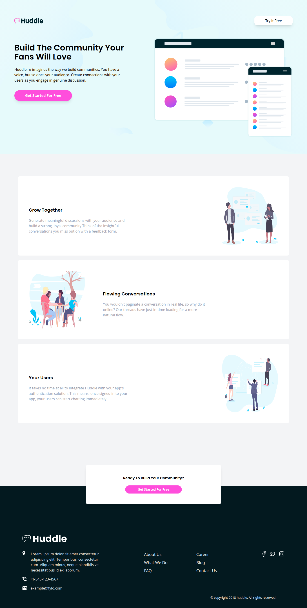
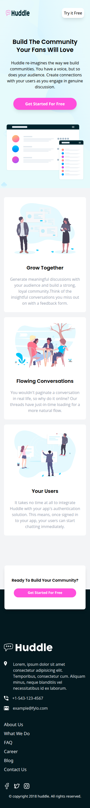

# Frontend Mentor - Huddle landing page with alternating feature blocks solution

This is a solution to the [Huddle landing page with alternating feature blocks challenge on Frontend Mentor](https://www.frontendmentor.io/challenges/huddle-landing-page-with-alternating-feature-blocks-5ca5f5981e82137ec91a5100).

## Table of contents

- [Overview](#overview)
  - [Screenshot](#screenshot)
  - [The challenge](#the-challenge)
  - [Links](#links)
- [My process](#my-process)
  - [Built with](#built-with)
- [Author](#author)

## Overview

### Screenshot

  ## Desktop 
  
  ## Mobile
  

### The challenge

Users should be able to:

  - View the optimal layout for the site depending on their device's screen size
  - See hover states for all interactive elements on the page

### Links

- Solution URL: [solution](https://github.com/Medido1/Huddle-landing-page-with-alternating-feature-blocks)
- Live Site URL: [live site](https://huddlelandingpage0.netlify.app/)

## My process

### Built with

- React
- Tailwindcss
- Flexbox
- Grid
- Mobile-first workflow

## Author

- Frontend Mentor - [@Medido1](https://www.frontendmentor.io/profile/Medido1)
- GitHub - [@Medido1](https://github.com/Medido1)